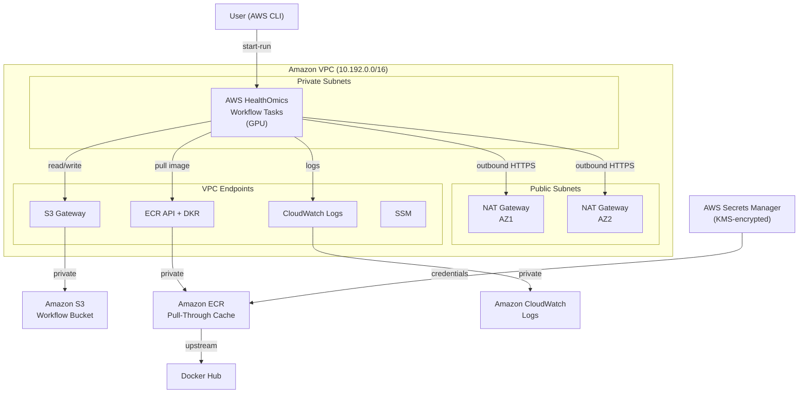

<!-- Copyright Amazon.com, Inc. or its affiliates. All Rights Reserved. -->
<!-- SPDX-License-Identifier: Apache-2.0 -->

# AWS HealthOmics Workflow for Biomolecule Structure Prediction Using OpenFold3

OpenFold3 is an open-source biomolecular structure prediction model developed by the AlQuraishi Lab at Columbia University and the OpenFold consortium. It predicts 3D structures for proteins, RNA, DNA, and small molecules — including complexes — and aims to be a faithful reproduction of DeepMind's AlphaFold3. This repository packages OpenFold3 inference as an [AWS HealthOmics](https://aws.amazon.com/healthomics/) workflow so you can run GPU-accelerated structure predictions as a managed service.

## Repository layout

```bash
workflow/                   # AWS HealthOmics workflow definition
  main.nf                   #   Nextflow workflow (validate + predict)
  nextflow.config           #   Nextflow configuration
  parameter-template.json   #   Workflow parameter schema
  container-registry-map.json # Docker Hub → Amazon ECR pull-through mapping
cloudformation/
  vpc.yaml                  # Amazon VPC, subnets, NAT, VPC endpoints, Omics VPC config
  services.yaml             # AWS Secrets Manager, Amazon ECR pull-through cache,
                            #   registry policy, repo creation template, IAM role
examples/                   # Example query JSON files for various prediction types
deploy.sh                   # End-to-end deploy & run script
destroy.sh                  # Tear down all deployed resources
```

## Dependencies

This workflow relies on two external resources that are fetched automatically at runtime:

- **Model parameters** — `s3://openfold3-data/openfold3-parameters/of3-p2-155k.pt` (public Amazon Simple Storage Service (Amazon S3) bucket). Override with the `params` workflow parameter.
- **Docker container** — [`openfoldconsortium/openfold3`](https://hub.docker.com/r/openfoldconsortium/openfold3) on Docker Hub, pulled via the Amazon Elastic Container Registry (Amazon ECR) pull-through cache.

## Prerequisites

- AWS CLI v2 with credentials configured for the target account
- A Docker Hub account (free tier is fine) for Amazon ECR pull-through cache authentication
- An Amazon S3 bucket for workflow inputs and outputs (see below)

### S3 bucket setup

The workflow bucket stores query inputs, prediction outputs, model parameters, and the
workflow definition zip. **`deploy.sh` automatically creates the bucket** if it does not
already exist, with the following security settings applied:

| Setting | Applied automatically | Detail |
| ------- | -------------------- | ------ |
| Default encryption | Yes | SSE-S3 (`AES256`) |
| Block Public Access | Yes | All four settings enabled |
| Versioning | Yes | Protects against accidental overwrites and deletions |
| TLS-enforcement bucket policy | Yes | Denies all non-HTTPS requests |
| Server access logging | Yes | Logs to `<bucket-name>-logs` with prefix `access-logs/` |

The `openfold3-services` CloudFormation stack also attaches a TLS-enforcement bucket
policy as a defense-in-depth layer.

If you pass an existing bucket, the script skips creation and uses it as-is. In that
case, verify the bucket has the settings above.

> **Note**: `destroy.sh` does not delete the bucket or its logs bucket. It only
> removes objects created during deployment (workflow definitions, examples,
> model parameters). Delete the buckets manually when you no longer need them.

## Architecture



The deployment creates two AWS CloudFormation stacks:

1. **openfold3-vpc** — Amazon VPC with public/private subnets across two AZs, a NAT gateway per AZ, and Amazon VPC endpoints (Amazon S3, Amazon ECR, AWS Systems Manager, Amazon CloudWatch Logs). Based on the [AWS CodeBuild VPC template](https://docs.aws.amazon.com/codebuild/latest/userguide/cloudformation-vpc-template.html) with the addition of Amazon VPC endpoints.
2. **openfold3-services** — Docker Hub credentials in AWS Secrets Manager, Amazon ECR pull-through cache rule and registry policy, repository creation template, AWS HealthOmics VPC configuration, AWS HealthOmics workflow, and an IAM service role for workflow runs.

## Deployment

`deploy.sh` handles everything: AWS CloudFormation stacks, workflow creation, and starting a run. Docker Hub credentials are passed via environment variables.

```bash
export DOCKER_HUB_USERNAME="your-username"
export DOCKER_HUB_ACCESS_TOKEN="dckr_pat_..."

# Full deploy — infrastructure + run
./deploy.sh --bucket my-omics-bucket

# Or run individual stages
./deploy.sh --bucket my-omics-bucket --stacks-only      # CloudFormation only
./deploy.sh --bucket my-omics-bucket --run-only          # Start a run only
```

It then packages the `workflow/` directory, uploads it to S3, and optionally starts a run with `query_ubiquitin.json`.

## Running a prediction

Upload your query JSON to S3 and start a run:

```bash
aws s3 cp my_query.json s3://my-omics-bucket/inputs/my_query.json

aws omics start-run \
  --workflow-id <WORKFLOW_ID> \
  --role-arn <ROLE_ARN> \
  --output-uri s3://my-omics-bucket/healthomics-outputs/ \
  --storage-type DYNAMIC \
  --name "my-prediction" \
  --parameters '{"query_json": "s3://my-omics-bucket/inputs/my_query.json"}' \
  --region us-west-2
```

The workflow accepts these parameters (see `workflow/parameter-template.json`):

| Parameter | Required | Description |
| ----------- | ---------- | ------------- |
| `query_json` | Yes | S3 URI to the OpenFold3 query JSON file |
| `runner_yml` | No | S3 URI to a runner configuration YAML |
| `params` | No | S3 URI to model parameters (defaults to public checkpoint) |
| `use_msa_server` | No | Enable MSA server (`true`/`false`). Requires VPC-connected run with internet access |
| `extra_args` | No | Additional CLI flags for `run_openfold predict` |

## Monitoring a run

```bash
# Check run status
aws omics get-run --id <RUN_ID> --region us-west-2

# List tasks in a run
aws omics list-run-tasks --id <RUN_ID> --region us-west-2

# View task logs
aws omics get-run-task --id <RUN_ID> --task-id <TASK_ID> --region us-west-2
```

## Example queries

The `examples/` directory contains query JSON files covering a range of prediction scenarios, sourced from the [OpenFold3 repository](https://github.com/aqlaboratory/openfold-3/tree/main/examples/example_inference_inputs). These are uploaded to `s3://<bucket>/examples/` during deployment.

| File | Description |
| ---- | ----------- |
| `query_ubiquitin.json` | Single-chain protein (ubiquitin, 76 residues). Quick smoke test. |
| `query_homomer.json` | Homomeric protein — leucine zipper with two identical chains (A, B). |
| `query_multimer.json` | Heteromeric protein complex (PDB 7CNX) with two distinct chain types across four chain IDs. |
| `query_protein_ligand.json` | Protein (MCL1) with an ATP ligand (CCD code) and a small molecule (SMILES). |
| `query_protein_ligand_multiple.json` | Batch query — two predictions of MCL1 with different small-molecule ligands. |
| `query_single_protein_single_ligand.json` | Single protein with a single ligand (toluene via SMILES, PDB 7L39). |
| `query_dna_ptm.json` | DNA strand with post-transcriptional modifications (pseudouridine and 5-methylcytosine). |

To run any example after deployment:

```bash
aws omics start-run \
  --workflow-id <WORKFLOW_ID> \
  --role-arn <ROLE_ARN> \
  --output-uri s3://my-omics-bucket/healthomics-outputs/ \
  --storage-type DYNAMIC \
  --name "example-run" \
  --parameters '{"query_json": "s3://my-omics-bucket/examples/query_homomer.json"}' \
  --region us-west-2
```

## Testing with the example query

The included `query_ubiquitin.json` predicts the structure of ubiquitin (76 residues, single chain). It's a quick smoke test:

```bash
./deploy.sh --bucket my-omics-bucket --run-only
```

This uploads `query_ubiquitin.json` to `s3://<bucket>/inputs/` and starts a run. Outputs are written to `s3://<bucket>/healthomics-outputs/`.

## Security

Security is a [shared responsibility](https://aws.amazon.com/compliance/shared-responsibility-model/)
between AWS and the customer.

**AWS is responsible for** securing the underlying infrastructure that runs
AWS HealthOmics, Amazon ECR, AWS Secrets Manager, Amazon VPC, AWS KMS, and
Amazon CloudWatch Logs — including physical security, host operating systems,
and service availability.

**Customers are responsible for** configuring and operating the security
controls described below, including encryption settings, IAM permissions,
credential rotation, network monitoring, and access reviews.

### Implementation priority

1. **Critical (deploy day)**: Verify Amazon S3 bucket encryption and Block
   Public Access settings; confirm AWS Key Management Service (AWS KMS) key is
   active for AWS Secrets Manager.
2. **High (first week)**: Review AWS Identity and Access Management (IAM)
   permissions with IAM Access Analyzer; establish Amazon VPC Flow Log
   monitoring baseline.
3. **Medium (first month)**: Set up credential rotation schedule; enable
   AWS CloudFormation termination protection; verify Amazon S3 access logging.

### Recommended practices

- **Amazon S3 bucket security** — Create the workflow bucket with encryption,
  Block Public Access, and versioning enabled (see
  [S3 bucket setup](#s3-bucket-setup)). The `openfold3-services` stack attaches
  a bucket policy denying non-HTTPS requests. When configured as described,
  encryption at rest covers all objects and public access is blocked.
- **Credential management** — Rotate Docker Hub credentials periodically and
  update the AWS Secrets Manager secret. Credentials should not be committed to
  version control.
- **IAM permissions** — Review the `HealthOmicsWorkflowRole` permissions after
  deployment using
  [IAM Access Analyzer](https://docs.aws.amazon.com/IAM/latest/UserGuide/what-is-access-analyzer.html)
  to identify unused permissions. The role is scoped to 2 Amazon S3 buckets,
  1 log group, and specific Amazon ECR repositories.
- **Network monitoring** — Review Amazon VPC Flow Logs in Amazon CloudWatch Logs
  (`/aws/vpc/flowlogs/openfold3`) for anomalous traffic. Private subnets
  eliminate direct internet ingress.
- **Encryption** — AWS Secrets Manager secrets are encrypted with a
  customer-managed AWS KMS key (`alias/openfold3-secrets`). Amazon S3 bucket
  encryption is configured at bucket creation time.
- **Access review** — Audit IAM role usage through AWS CloudTrail and remove
  permissions that are not actively used.
- **MFA Delete** — For production deployments storing sensitive genomic data,
  consider enabling MFA Delete on the workflow bucket. MFA Delete requires root
  account credentials and cannot be automated in the deployment script. See the
  [AWS documentation](https://docs.aws.amazon.com/AmazonS3/latest/userguide/MultiFactorAuthenticationDelete.html)
  for details.

### Encryption

| Data | At rest | In transit |
| ---- | ------- | ---------- |
| Docker Hub credentials | AWS KMS (customer-managed key) | HTTPS (Secrets Manager API) |
| S3 objects (inputs, outputs, model params) | SSE-S3 or SSE-KMS (bucket setting) | HTTPS enforced by bucket policy |
| CloudWatch Logs | AWS-managed encryption | HTTPS (VPC endpoint) |

### Security documentation

Detailed security documentation is available in the `docs/` directory:

- [`docs/security-design.md`](docs/security-design.md) — Architecture decisions, rationale, and trade-offs
- [`docs/threat-model.md`](docs/threat-model.md) — Assets, trust boundaries, threats, and mitigations
- [`docs/security-guidelines.md`](docs/security-guidelines.md) — Per-service security guidelines

## Third-party AI resources

This workflow uses the [OpenFold3](https://github.com/aqlaboratory/openfold-3)
model developed by the AlQuraishi Laboratory at Columbia University and the
OpenFold Consortium. Customers are responsible for performing their own review of model assets - they are not distributed within this project.

### AI security controls

- **Input validation**: Query JSON files are validated for syntax and the
  required `queries` key by the `VALIDATE_QUERY_JSON` process before inference.
  The validation checks JSON structure but does not perform deep schema
  validation of individual query fields — this is handled by the OpenFold3
  inference engine, which rejects malformed inputs.
- **Model integrity**: Model parameters are fetched from a known Amazon S3
  source (`s3://openfold3-data/`) or a user-specified URI. Verify model file
  checksums after download for production deployments.
- **Network isolation**: Workflow tasks run in private subnets with no inbound
  internet access. Outbound traffic is restricted to HTTPS (port 443).
- **Access control**: The IAM service role limits Amazon S3, Amazon ECR, and
  Amazon CloudWatch access to specific resources with condition blocks.
- **Audit logging**: All API calls are logged through AWS CloudTrail. Workflow
  task logs are streamed to Amazon CloudWatch Logs.
- **Inference monitoring**: Workflow run status and task-level metrics are
  available through the `aws omics get-run` and `aws omics list-run-tasks` APIs
  for detecting anomalous execution patterns.

## Model limitations

### Known limitations

- Prediction accuracy varies based on sequence similarity to the training data.
  Performance may be lower for novel protein families or synthetic sequences.
- GPU memory limits the maximum complex size. Very large multimeric complexes
  may require adjusting resource allocations.

### Responsible use

- Predictions are intended for **research purposes only**, not for clinical
  decision-making, drug approval, or diagnostic use.
- Results should be validated through experimental methods (X-ray
  crystallography, cryo-EM, NMR) before drawing biological conclusions.
- Users should be aware of potential biases toward well-studied protein families
  that are overrepresented in the PDB training data.

### Fairness considerations

- Model performance is consistent across different types of biomolecules within
  its training domain. No demographic or population-based biases apply to
  molecular structure prediction.
- The model does not process personally identifiable information.

## Cleanup

`destroy.sh` tears down everything created by `deploy.sh`: Amazon ECR repositories from the pull-through cache, both AWS CloudFormation stacks, and Amazon S3 objects.

```bash
./destroy.sh --bucket my-omics-bucket
```
