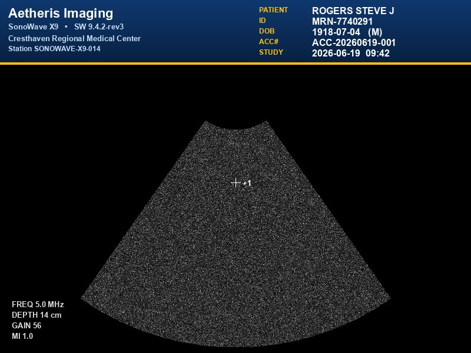
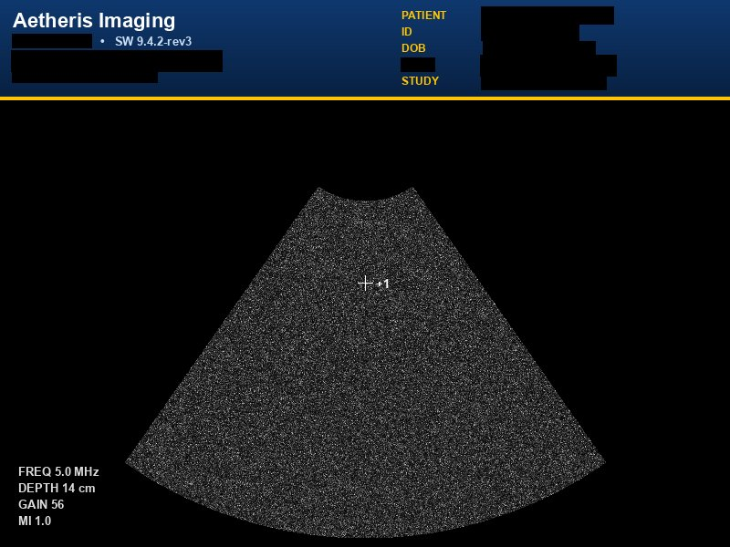

# DICOM De-identification Workflow

An AWS HealthOmics workflow that removes Protected Health Information (PHI)
from DICOM studies — both metadata attributes and burned-in pixel-data text —
using the DICOM PS3.15 Basic Application Level Confidentiality Profile layered
with TCIA's standard option set.

The repository ships everything needed to deploy the workflow: a WDL
definition, a container Dockerfile, a reference de-identification profile,
and the runtime Python package.

---

## Repository layout

```
.
├── Dockerfile                                       # builds the image used by the workflow
├── build_and_push_container.sh                      # builds + pushes the image to ECR
├── workflow/dicom_deidentification.wdl              # WDL workflow definition
├── parameter-template.json                          # parameter schema (HealthOmics workflow registration)
├── parameter-description.json                       # parameter descriptions + sample useCase values
├── inputs.json                                      # sample inputs file for `aws omics start-run`
├── profiles/ps315_basic_tcia_v1.json                # reference PS3.15 + TCIA profile
├── src/dicom_deid/                                  # runtime Python package
└── pyproject.toml                                   # Python packaging metadata
```

---

## What the workflow does

For every DICOM instance under the input prefix, in this order:

1. **Metadata de-identification** — applies the per-tag actions from the
   profile (`hash_*` / `date_shift` / `truncate` / `remove` / `keep`),
   drops private tags, and remaps every UID-typed element through a
   salted-deterministic generator so cross-references (referenced SOPs,
   Frame-of-Reference UIDs, …) reconnect correctly.
2. **Pixel text detection** *(optional, GPU-accelerated)* — runs EasyOCR on
   each frame, with optional CLAHE contrast enhancement and Lanczos
   upscaling for low-resolution annotation strips.
3. **PHI classification** — fuzzy-matches every detected text region
   against PHI values pulled from the original DICOM metadata (patient
   name, ID, accession number, dates, etc.).
4. **Pixel masking** — fills black rectangles over text regions classified
   as PHI; re-encodes the modified pixels as Explicit VR Little Endian.
5. **Write outputs** — de-identified DICOM, CSV mapping, manifest, and
   per-instance detection reports.

### What it looks like

A synthetic ultrasound frame with burned-in PHI (patient name, MRN,
DOB, accession number, study timestamp, station ID, hospital name)
processed end-to-end through the workflow:

| Before | After |
|---|---|
|  |  |

PHI text regions matched against metadata are masked unconditionally;
non-PHI overlays (scanner mode, frequency, depth, gain, MI,
measurement annotations) are preserved. Behavior on unmatched OCR
text is configurable via `unmatched_text_policy`
(`mask` / `keep` / `fail`); the example above uses `keep`.

---

## Workflow inputs

| Input | Type | Required | Description |
|---|---|---|---|
| `dicom_input_prefix` | `Directory` | yes | S3 prefix containing DICOM files. HealthOmics localizes the entire prefix into a directory before the task starts; nested layout is preserved. |
| `deidentification_profile` | `File` | yes | S3 path to a JSON profile (see [profiles/](profiles/)). |
| `container` | `String` | yes | ECR image URI built by [`build_and_push_container.sh`](build_and_push_container.sh). |
| `emit_jpeg_previews` | `Boolean` | no (default `false`) | Write `<sop_uid>.before.jpg` / `<sop_uid>.after.jpg` per instance for visual verification of mask placement. |

A complete sample inputs file is available at
[`inputs.json`](inputs.json); the schema HealthOmics consumes when
registering the workflow is in
[`parameter-template.json`](parameter-template.json).

The WDL uses `version development` because HealthOmics' parser supports it
and that's the version that introduces the `Directory` type — letting the
workflow take an S3 prefix natively rather than enumerating files.

---

## Workflow outputs

| Output | Type | Description |
|---|---|---|
| `deidentified_output` | `Directory` | De-identified DICOM files (and optional diagnostic artifacts), organized by **de-identified** UID. |
| `csv_mapping` | `File` | `csv_mapping.csv` — original → de-identified UID/PatientID mapping with per-stage status. |
| `job_manifest` | `File` | `job_output_manifest.json` — hierarchical Study → Series → Instance status with summary counts. |

HealthOmics writes outputs under `s3://<output-uri>/<run-id>/out/`,
one subdirectory per output. A typical run produces:

```
out/
├── csv_mapping/
│   └── csv_mapping.csv
├── job_manifest/
│   └── job_output_manifest.json
└── deidentified_output/
    └── output/
        ├── 2.25.95275…577615/                          # de-id study UID
        │   └── 2.25.18322…732004/                      # de-id series UID
        │       ├── 2.25.34784…047516.dcm               # de-id SOP UID
        │       └── 2.25.51512…621756.dcm
        ├── detection_reports/                          # only when pixel detection is on
        │   ├── 2.25.34784…047516.json
        │   └── 2.25.51512…621756.json
        └── jpeg_previews/                              # only with --emit-jpeg-previews
            ├── 2.25.34784…047516.before.jpg
            ├── 2.25.34784…047516.after.jpg
            ├── 2.25.51512…621756.before.jpg
            └── 2.25.51512…621756.after.jpg
```

The DICOM tree is keyed entirely by de-identified UIDs — original
file paths are deliberately dropped on output, since site-organized
DICOM directories often encode PHI in folder/filenames (patient
name, MRN, accession). The source ↔ output correlation lives in
`csv_mapping.csv`.

### `csv_mapping.csv`

One row per input instance, written as a flat CSV with these
columns (in order):

```
original_patient_id, deidentified_patient_id,
original_study_uid, deidentified_study_uid,
original_series_uid, deidentified_series_uid,
original_sop_instance_uid, deidentified_sop_instance_uid,
original_file_path, output_file_path,
metadata_status, pixel_detection_status, pixel_masking_status,
bounding_boxes_found
```

A single row, presented vertically (real values, abbreviated):

```
original_patient_id              292821506
deidentified_patient_id          cc1249242c80213c
original_study_uid               1.2.826.0.1.3680043.8.498.63807…978542
deidentified_study_uid           2.25.95275620404875740047949…577615
original_series_uid              1.2.826.0.1.3680043.8.498.86503…260443
deidentified_series_uid          2.25.18322935295263245993288…732004
original_sop_instance_uid        1.2.826.0.1.3680043.8.498.12368…435257
deidentified_sop_instance_uid    2.25.34784386522270630808034…047516
original_file_path               …/292821506_XR_CHEST_AP_PORTABLE.dcm
output_file_path                 output/2.25.95275…577615/2.25.18322…732004/2.25.34784…047516.dcm
metadata_status                  success
pixel_detection_status           success
pixel_masking_status             success
bounding_boxes_found             12
```

`bounding_boxes_found` is the count of OCR text regions detected
in pixel data (empty when detection is disabled).

Status values follow the pattern documented in
[`src/dicom_deid/models.py`](src/dicom_deid/models.py) (`METADATA_*`,
`PIXEL_DETECTION_*`, `PIXEL_MASKING_*`).

### `job_output_manifest.json`

Hierarchical view of the run with a top-level summary block.
Studies roll up from series, series roll up from instances, with
status `success` (all children OK), `partial` (some children
failed), or `failed` (none succeeded).

```json
{
  "workflow_status": "success",
  "summary": {
    "total_studies": 480,
    "total_series": 480,
    "total_instances": 480,
    "studies_by_status":    {"success": 480, "partial": 0, "failed": 0},
    "series_by_status":     {"success": 480, "partial": 0, "failed": 0},
    "instances_by_outcome": {"success": 480, "skipped": 0, "failed": 0}
  },
  "studies": [
    {
      "original_study_uid":     "1.2.826.0.1.3680043.8.498.63807…978542",
      "deidentified_study_uid": "2.25.95275620404875740047949…577615",
      "study_status": "success",
      "series": [
        {
          "original_series_uid":     "1.2.826.0.1.3680043.8.498.86503…260443",
          "deidentified_series_uid": "2.25.18322935295263245993288…732004",
          "series_status": "success",
          "instances": [
            {
              "original_sop_instance_uid":     "1.2.826.0.1.3680043.8.498.12368…435257",
              "deidentified_sop_instance_uid": "2.25.34784386522270630808034…047516",
              "metadata_status": "success",
              "pixel_detection_status": "success",
              "pixel_masking_status": "success"
            }
          ]
        }
      ]
    }
  ]
}
```

`workflow_status` is `success` if at least one instance succeeded —
a single corrupt input doesn't mask the rest of the work as a hard
failure. Per-instance status surfaces the actual outcome of every
file in the manifest tree.

---

## De-identification profile

The profile JSON is the **single source of truth** for de-identification
policy. There is no engine-side baseline of "default" tag actions — tags
absent from the profile pass through unchanged (modulo two engine-wide
guarantees: `drop_private_tags` removes private tags, and every VR=UI
element is remapped through the salted-deterministic UID generator
regardless of whether it appears in the profile).

The shipped [`profiles/ps315_basic_tcia_v1.json`](profiles/ps315_basic_tcia_v1.json)
encodes the DICOM Basic Application Level Confidentiality Profile (PS3.15
Annex E) layered with TCIA's three standard options: *Retain Modified
Longitudinal Temporal Information*, *Retain Patient Characteristics*,
*Retain Device Identity*.

To use it: copy the file, replace the `salt` value with a project-specific
secret, and submit the result as the workflow's `deidentification_profile`
input.

When PS3.15 or the TCIA option set ships changes, regenerate this file
with a new version suffix (`_v2.json`, `_v3.json`, …) rather than mutating
it in place — operators reference a specific filename so policy diffs are
an explicit upgrade rather than a silent change.

A minimal self-contained profile is also valid:

```json
{
  "salt": "your-project-salt",
  "attribute_overrides": {
    "(0010,0020)": "hash_16",
    "(0010,0010)": "hash_16",
    "(0008,0050)": "hash_16",
    "(0008,0020)": "date_shift",
    "(0008,0080)": "remove",
    "(0008,0060)": "keep"
  },
  "drop_private_tags": true,
  "drop_tags_list": ["(0008,0081)"],
  "max_date_shift_days": 365,
  "enable_pixel_text_detection": true,
  "enable_pixel_masking": true
}
```

Top-level keys starting with `_` (e.g. `_comment`, `_version`) are treated
as JSON comments and ignored by the loader.

### Profile fields

#### Core de-identification policy

| Field | Type | Default | Description |
|---|---|---|---|
| `salt` | string | **required** | Salt for deterministic hashing and date offsets. Same salt + same input ⇒ same output across runs. |
| `attribute_overrides` | object | `{}` | Per-tag action map. Each value is one of the [actions](#actions) below. |
| `drop_private_tags` | bool | `true` | Remove all DICOM private tags (groups with odd numbers). |
| `drop_tags_list` | array | `[]` | Specific public tags to remove, in `(GGGG,EEEE)` format. |
| `override_tag_list` | array | `[]` | Stamp values into specific tags (e.g. clinical-trial ID, study-description prefix). See [Tag overrides](#tag-overrides) below. |
| `max_date_shift_days` | int | `365` | Per-patient deterministic date offset is computed `mod` this value. |
| `replace_uids` | bool | `true` | Remap every VR=UI element through the salted UID generator. Recurses into sequences so referenced UIDs reconnect to their parents automatically. |

> **Defaults match the shipped reference profile.** A profile that
> omits these fields gets the same behaviour as
> `profiles/ps315_basic_tcia_v1.json`. To opt out, set the field
> explicitly.

#### Pixel-data PHI detection / masking

| Field | Type | Default | Description |
|---|---|---|---|
| `enable_pixel_text_detection` | bool | `true` | Run OCR on pixel data. Requires GPU for reasonable throughput. |
| `enable_pixel_masking` | bool | `true` | Apply black rectangles over PHI text. Has no effect if detection is off. |
| `mask_lossy_images` | bool | `true` | Allow re-encoding lossy-compressed images to apply masks. When `false`, lossy instances pass through with `pixel_masking_status=skipped_lossy`. |
| `unmatched_text_policy` | string | `mask` | What to do with OCR text that doesn't match any metadata PHI value: `mask` (treat as PHI), `keep` (leave intact), `fail` (block the instance). |
| `allow_unsupported_pixel_ts` | bool | `false` | Allow instances with undecodable pixel codecs (e.g. JPEG-XL) to pass through unmasked. **Hard failure by default** to prevent silent PHI leaks. |
| `enable_clahe` | bool | `true` | Run an extra OCR pass on a CLAHE-equalized image to recover gray-on-gray text. |
| `clahe_clip_limit` | float | `2.0` | CLAHE `clipLimit` (higher = stronger contrast amplification). |
| `ocr_upscale_factor` | int | `2` | Lanczos upscale factor before OCR. `2` recovers small (4–7 px) text on CT/MR slices. `1` disables. |

#### Runtime

| Field | Type | Default | Description |
|---|---|---|---|
| `inline_checkpoint_every` | int | `50` | Flush a partial manifest every N processed instances. `0` disables. Defends against C-level crashes losing prior work. |

### Tag overrides

`override_tag_list` lets the profile **write** values into specific
tags — useful for stamping a clinical-trial identifier, prefixing a
study description, marking a cohort, etc. Each entry has a `tag`, a
`value`, and an optional `mode`:

```json
"override_tag_list": [
  {"tag": "(0012,0020)", "value": "TRIAL-XYZ-2026"},
  {"tag": "(0008,1030)", "value": "[TRIAL] ", "mode": "prefix"},
  {"tag": "(0008,103E)", "value": " (anonymized)", "mode": "suffix"}
]
```

| Mode | Behavior |
|---|---|
| `replace` *(default)* | Discard the current value and write `value`. |
| `prefix` | Concatenate `value + existing` (existing kept verbatim). |
| `suffix` | Concatenate `existing + value`. |

**Apply order.** Overrides run **after** all per-tag actions (hash,
date_shift, remove, …). A profile that hashes `(0008,1030)` and
prefixes it with `[TRIAL] ` produces `[TRIAL] <hashed>`, never
`[TRIAL] <raw PHI>`.

**Tag must exist or be in the DICOM dictionary.** If the tag is
absent from the instance the engine creates it (looking up the VR
from the public DICOM data dictionary). Private/unknown tags are
refused — overrides only work on tags whose VR can be resolved
unambiguously.

**String VRs only.** Numeric / binary VRs (`US`, `UL`, `OB`, …)
are rejected at profile load. The supported VRs cover the typical
"label/identifier" use cases: `AE AS CS DA DS DT IS LO LT PN SH ST
TM UC UI UR UT`.

**Length is capped to the VR's standard maximum** (DICOM PS3.5 §6.2)
by right-truncation. For example, a `prefix` operation on
`AccessionNumber` (VR `SH`, max 16) where existing+supplied = 20
chars produces a 16-char value. If you need to preserve the
prefix exactly, use `replace` and supply a fully-formed value.

A failed override on one tag (e.g. unknown private tag, non-string
VR) is logged and skipped — it does not abort the rest of the
instance's de-identification.

### Actions

Used as values in `attribute_overrides` and `drop_tags_list`.

| Action | Description | Example |
|---|---|---|
| `hash_8` | SHA-256(salt + value) truncated to 8 hex chars | `a3f2b8c1` |
| `hash_16` | SHA-256(salt + value) truncated to 16 hex chars | `a3f2b8c1d4e5f6a7` |
| `hash_24` | SHA-256(salt + value) truncated to 24 hex chars | `a3f2b8c1d4e5f6a7b8c9d0e1` |
| `hash_32` | SHA-256(salt + value) truncated to 32 hex chars | `a3f2b8c1d4e5f6a7b8c9d0e1f2a3b4c5` |
| `date_shift` | Shift the value by a per-patient deterministic offset. **VR-aware**: shifts `DA` and the date portion of `DT`; passes `TM` through unchanged (a date offset on a time-of-day is meaningless). |
| `truncate` | Reduce specificity. Currently used for Patient Age (`045Y` → `040Y`). |
| `remove` | **VR-aware**. String VRs become `""` (Type 2 empty); `SQ` becomes `[]`; numeric/binary VRs (`US`, `UL`, `FL`, …) are deleted entirely (no DICOM-valid empty string representation). |
| `keep` | Preserve unchanged. |

If a per-tag action raises an exception (e.g. malformed input value),
the engine logs a warning and falls back to `remove` for that tag —
no single bad value can abort the rest of the instance's de-identification.
The unparseable value is **never** logged.

---

## Supported transfer syntaxes

Pixel decoding is required for any instance the workflow needs to mask.
All listed plugins use permissive licenses; `pylibjpeg-libjpeg` (GPLv3)
is deliberately not included.

| Transfer Syntax | UID | Decoder | License |
|---|---|---|---|
| Implicit VR Little Endian | 1.2.840.10008.1.2 | pydicom | MIT |
| Explicit VR Little Endian | 1.2.840.10008.1.2.1 | pydicom | MIT |
| RLE Lossless | 1.2.840.10008.1.2.5 | pydicom | MIT |
| JPEG Baseline | 1.2.840.10008.1.2.4.50 | pillow | MIT-CMU |
| JPEG-LS Lossless | 1.2.840.10008.1.2.4.80 | pyjpegls | MIT |
| JPEG-LS Near-Lossless | 1.2.840.10008.1.2.4.81 | pyjpegls | MIT |
| JPEG 2000 Lossless | 1.2.840.10008.1.2.4.90 | pylibjpeg-openjpeg | MIT |
| JPEG 2000 Lossy | 1.2.840.10008.1.2.4.91 | pylibjpeg-openjpeg | MIT |
| HTJ2K Lossless | 1.2.840.10008.1.2.4.201 | pylibjpeg-openjpeg | MIT |
| HTJ2K RPCL Lossless | 1.2.840.10008.1.2.4.202 | pylibjpeg-openjpeg | MIT |
| HTJ2K | 1.2.840.10008.1.2.4.203 | pylibjpeg-openjpeg | MIT |

JPEG XL transfer syntaxes (`.110`, `.111`, `.112`) are **not currently
supported**. Instances with unsupported codecs are reported as
`pixel_masking_status=failed_unsupported_ts` unless
`allow_unsupported_pixel_ts=true`, in which case they pass through
unmasked with status `skipped_unsupported_ts`.

---

## Deploying to AWS HealthOmics

### 1. Build and push the container image

The workflow runs on a HealthOmics-managed GPU instance, so the image
must be built for `linux/amd64` and pinned to a torch + CUDA combination
compatible with HealthOmics' host driver.
[`build_and_push_container.sh`](build_and_push_container.sh) wraps the
full sequence — ECR login, repo creation, build, repository policy,
and push — in one command:

```bash
./build_and_push_container.sh \
  --account-id 123456789012 \
  --region us-east-1
```

Options: `--repo` (default `dicom-deid`), `--tag` (default `latest`),
`--skip-build` to re-tag and re-push only, `--docker` or `--finch` to
override the default `podman` runtime.

The script also attaches a repository policy granting
HealthOmics' service principal (`omics.amazonaws.com`) pull access,
restricted to runs originating from the same account via
`aws:SourceAccount`. Without this, the workflow fails to start with
`Unable to access image URI`.

The script prints the resulting image URI; supply it as the
workflow's `container` input.

### 2. Register the WDL workflow

```bash
zip /tmp/workflow.zip -j workflow/dicom_deidentification.wdl

aws omics create-workflow \
  --name dicom-deidentification \
  --engine WDL \
  --definition-zip fileb:///tmp/workflow.zip \
  --parameter-template file://parameter-template.json \
  --region us-east-1
```

Note the returned workflow `id` and wait for status to reach `ACTIVE`.

### 3. Stage inputs to S3

```bash
# Profile (replace REPLACE_ME first!)
cp profiles/ps315_basic_tcia_v1.json my_profile.json
# edit my_profile.json: replace "REPLACE_ME" with a project-specific salt
aws s3 cp my_profile.json s3://YOUR-BUCKET/dicom-deid/profile.json

# DICOM input set
aws s3 sync /local/dicom/ s3://YOUR-BUCKET/dicom-deid/input/
```

### 4. Start a run

Copy [`inputs.json`](inputs.json) and edit the four fields to match
your bucket, profile path, container URI, and preview toggle:

```bash
cp inputs.json my_run_inputs.json
# edit dicom_input_prefix, deidentification_profile, container

aws omics start-run \
  --workflow-id WORKFLOW_ID \
  --workflow-type PRIVATE \
  --role-arn arn:aws:iam::ACCOUNT:role/HealthOmicsServiceRole \
  --output-uri s3://YOUR-BUCKET/dicom-deid/output/ \
  --parameters file://my_run_inputs.json \
  --region us-east-1
```

The `HealthOmicsServiceRole` needs S3 read on the input prefix, S3 write
on the output URI, and ECR pull on the image. The
[`AmazonOmicsFullAccess`](https://docs.aws.amazon.com/aws-managed-policy/latest/reference/AmazonOmicsFullAccess.html)
managed policy is sufficient for evaluation; scope it down to the
specific S3 prefixes and ECR repository before any real workload.

Outputs land at `s3://YOUR-BUCKET/dicom-deid/output/{run_id}/out/...`
(HealthOmics auto-prefixes by run ID, so concurrent runs never collide).

### Runtime resources

The WDL pins:

```wdl
runtime {
    container: container        # supplied per run
    cpu: 16
    memory: "64 GB"
    acceleratorCount: 1
    acceleratorType: "nvidia-tesla-t4"
}
```

HealthOmics provisions a GPU-bearing instance (e.g. `omics.g4dn.4xlarge`)
that satisfies these requirements. The supported `acceleratorType` values
in `us-east-1` are: `nvidia-tesla-t4`, `nvidia-tesla-a10g`,
`nvidia-tesla-t4-a10g`, `nvidia-l4`, `nvidia-l40s`, `nvidia-l4-a10g`,
`nvidia-t4-a10g-l4`. T4 is sufficient for EasyOCR; A10g halves OCR
wall-clock at ~2× hourly cost.

GPU quota for HealthOmics is per-account, per-region. Check with:

```bash
aws service-quotas list-service-quotas \
  --service-code omics --region us-east-1 \
  --query 'Quotas[?contains(QuotaName,`GPU`)]'
```

---

## Local development

While the workflow is designed to run on HealthOmics, the runtime package
can be invoked directly for development and testing:

```bash
# Create venv with the dependencies the container ships
python3.10 -m venv .venv
source .venv/bin/activate

pip install --index-url https://download.pytorch.org/whl/cu121 \
    "torch==2.4.1" "torchvision==0.19.1"
pip install pydicom pylibjpeg pylibjpeg-openjpeg pyjpegls pillow \
            numpy opencv-python-headless rapidfuzz easyocr

# Stage a profile
cp profiles/ps315_basic_tcia_v1.json my_profile.json
# edit my_profile.json: replace REPLACE_ME with a salt

# Run the CLI directly
PYTHONPATH=src python -m dicom_deid.main \
  --input-dir /path/to/dicom/files \
  --profile my_profile.json \
  --output-dir /path/to/output

# Optional flags
PYTHONPATH=src python -m dicom_deid.main \
  --input-dir /path/to/dicom/files \
  --profile my_profile.json \
  --output-dir /path/to/output \
  --emit-jpeg-previews \                # diagnostic before/after JPEGs
  --allow-unsupported-pixel-ts          # opt-in: pass through undecodable codecs
```

The CLI also writes an environment summary block at startup (host
platform, library versions, GPU info, NVIDIA driver, run/task IDs) to
make HealthOmics task logs self-describing.

### CPU-only fallback

EasyOCR auto-falls-back to CPU when CUDA isn't available, so the same
container runs on CPU instances at lower throughput. CPU-only torch
wheels can be substituted in the Dockerfile by changing the
`--index-url` to `https://download.pytorch.org/whl/cpu`.

---

## Architecture notes

The runtime processes all instances in a single Python process — the OCR
model loads once and stays resident in GPU memory across the entire run.
This avoids paying the ~5 s per-instance EasyOCR-load cost that a
fork-per-instance model would incur. Per-instance failures are caught
and recorded as `metadata_status=failed` in the manifest; the run
continues. Periodic manifest checkpointing (`inline_checkpoint_every`)
defends against rare C-level crashes losing prior work.

Pipeline (per instance):

```
Load DICOM → Metadata De-id → [optional: Pixel Detection
                              → PHI Classification → Pixel Masking] → Write
```

PHI in pixels is detected via EasyOCR, optionally augmented with a
strip-local pass (a second OCR call on top/bottom annotation strips
with their own min/max normalization, recovering text that anatomy
windowing would otherwise clip), CLAHE contrast enhancement, and 2×
Lanczos upscaling for small text. Detected text is fuzzy-matched
against the original DICOM metadata (patient name, ID, dates, …) using
`rapidfuzz`; matches are masked, non-matches are subject to the
`unmatched_text_policy`.

Color (YBR-coded) ultrasound is converted to RGB before re-encoding so
the rebuilt DICOM's `PhotometricInterpretation=RGB` tag matches the
actual byte layout.

---

## Legal and privacy considerations

**Methodology / variability.** This workflow combines rules-based
metadata transformations (per-tag actions from the de-identification
profile) with **heuristic** pixel-data PHI detection (EasyOCR + CRAFT
detector + rapidfuzz matching against metadata values, optionally
augmented with CLAHE contrast enhancement and Lanczos upscaling).
Results may differ between studies, modalities, scanners, and datasets
due to input data quality, image contrast, font/glyph size, language,
and the inherent variability of OCR and fuzzy-matching algorithms.

**No compliance guarantee.** This software is provided as-is and is
**not guaranteed** to satisfy any specific legal, regulatory, or
compliance requirement — including, but not limited to, HIPAA Safe
Harbor, HIPAA Expert Determination, GDPR, the DICOM PS3.15 Basic
Application Level Confidentiality Profile, or any TCIA, IHE, or
site-specific de-identification standard. The shipped reference
profile encodes the PS3.15 Basic Profile layered with TCIA's standard
options as a **starting point**, not a certified implementation.

**User responsibility.** It is the user's responsibility to:

- choose and configure the de-identification profile (attribute
  actions, drop list, override list, salt, pixel-masking toggles)
  appropriately for the specific dataset, downstream use, and
  regulatory regime;
- validate the output of every run — both the metadata and the
  pixel-masked images — against representative samples before
  releasing data downstream;
- assess and accept the residual re-identification risk;
- maintain custody of the salt and any other secrets the profile
  references.

The maintainers make no warranty, express or implied, that any output
of this workflow is free of PHI or fit for any particular purpose.

---

## Reference

- DICOM PS3.15 Basic Application Level Confidentiality Profile:
  <https://dicom.nema.org/medical/dicom/current/output/chtml/part15/PS3.15.html>
- TCIA de-identification overview:
  <https://www.cancerimagingarchive.net/submission-tools-policies/>
- AWS HealthOmics workflow concepts:
  <https://docs.aws.amazon.com/omics/latest/dev/workflows.html>
